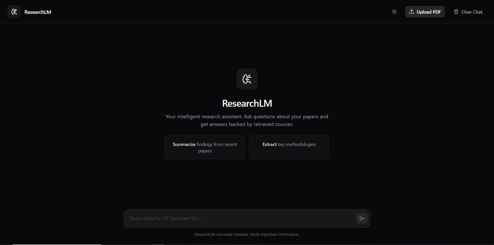
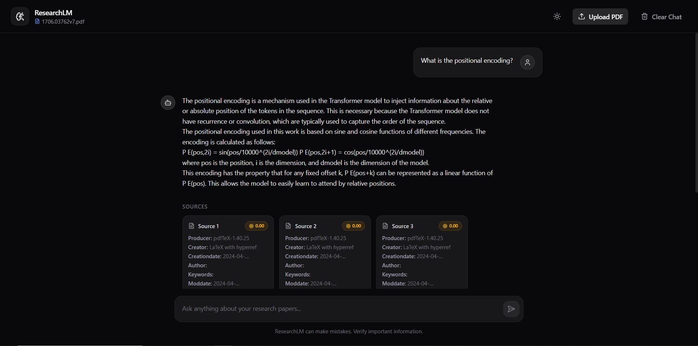
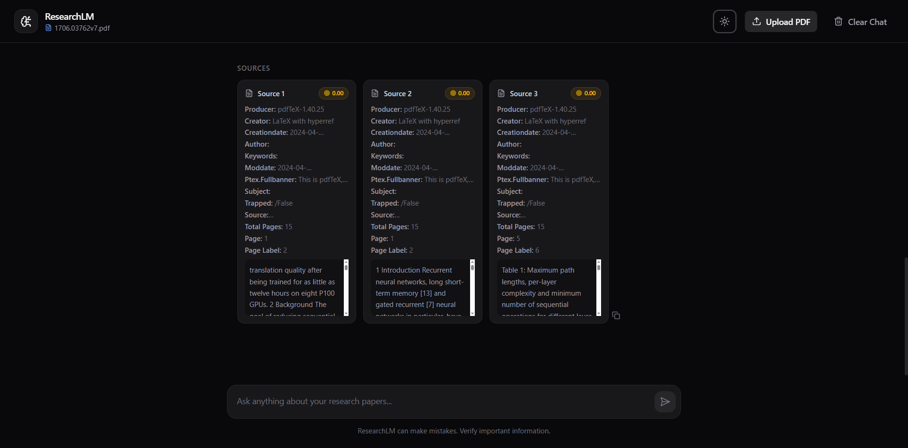

# ResearchLM: Document-Based AI Assistant

ResearchLM is a **full-stack, stateful AI assistant** designed to help users interact with **research papers** and **PDF documents**. Users can upload a document on the fly and ask **complex, multi-turn questions**. The application uses an advanced **Retrieval-Augmented Generation (RAG)** pipeline to provide accurate, grounded answers complete with **source citations** and **semantic confidence scores**.

---

# 🛠 Tech Stack

## Frontend

| Component | Technology |
|-----------|------------|
| Framework | React (Vite) |
| Styling & UI | Tailwind CSS |
| Animations | Framer Motion |
| Icons | Lucide React |
| API Handling | Axios |
| Markdown Rendering | React Markdown |
| Deployment | Vercel |

---

## Backend

| Component | Technology |
|-----------|------------|
| Framework | FastAPI |
| ASGI Server | Uvicorn |
| Session Storage | In-Memory Dictionary |
| File Handling | Temporary Files |
| Deployment | Render (Free Tier) |

---

## AI & RAG Pipeline

| Component | Technology |
|-----------|------------|
| Orchestration | LangChain |
| LLM Provider | Groq |
| Query Condensation | llama-3.3-70b-versatile |
| Response Generation | llama-3.1-8b-instant |
| Embeddings | HuggingFace (all-MiniLM-L6-v2) |
| Vector Database | Chroma (In-Memory) |
| Reranker | HuggingFace Cross-Encoder (BAAI/bge-reranker-base) |

---

# 📸 Application Preview

## 🏠 Home Page

<p align="center">
  
</p>

---

## 💬 Chat Interface

<p align="center">
  
</p>

---

## 📚 Source Citations

<p align="center">
  
</p>


# 🧠 How Chunking and Retrieval Works

The RAG pipeline in **ResearchLM** is built for **high precision** and **robust conversational memory**. Instead of relying on a basic RAG pipeline, it implements a **Dual-LLM + Hierarchical Chunking** architecture.

---

## 1. Ingestion & Hierarchical Chunking

When a user uploads a PDF:

- The document is parsed using **PyPDFLoader**.
- It is split using **ParentDocumentRetriever** from LangChain.

### Parent-Child Chunking Strategy

#### Child Chunks

- **Size:** 400 characters
- **Overlap:** 50 characters

These chunks are:

- Embedded using HuggingFace embeddings.
- Stored inside ChromaDB.
- Optimized for precise semantic retrieval.

Since they are relatively small, they capture fine-grained semantic information, leading to more accurate vector searches.

---

#### Parent Chunks

- **Size:** 2000 characters
- **Overlap:** 200 characters

These chunks are:

- Stored inside an in-memory document store.
- Returned to the LLM after retrieval.

---

### Why Parent-Child Chunking?

Instead of returning tiny fragments, the retriever:

1. Finds the most relevant **Child Chunk** using vector similarity.
2. Uses its mapping to retrieve the corresponding **Parent Chunk**.

This provides the LLM with enough surrounding context to generate coherent and complete answers rather than isolated sentences.

---

# 2. Stateful Memory & Query Condensation (Dual-LLM)

ResearchLM supports **multi-turn conversations**.

Every chat session is associated with a unique:

```text
session_id
```

The backend stores chat history in server memory.

---

### Why Query Condensation?

Users often ask follow-up questions like:

> "What are its requirements?"

The vector database cannot understand what **"its"** refers to.

Instead of directly searching with the ambiguous query, the pipeline first rewrites it.

Example:

**User Query**

```text
What are its requirements?
```

↓

**Condensed Search Query**

```text
What are the requirements of the Google File System?
```

---

### Dual-LLM Workflow

The larger **70B LLM** acts as a reasoning model.

Its responsibilities include:

- Reading chat history
- Understanding references
- Resolving pronouns
- Rewriting the query
- Producing a standalone search query

Only this rewritten query is used for retrieval.

---

# 3. Retrieval & Contextual Compression (Re-ranking)

The standalone query retrieves relevant **Parent Chunks**.

These chunks are then passed through the:

**BAAI/bge-reranker-base Cross-Encoder**

---

### Why Re-ranking?

Vector similarity only measures embedding distance.

It does **not** guarantee that retrieved chunks are truly relevant.

The Cross-Encoder instead:

- Reads the query.
- Reads each retrieved chunk.
- Scores them jointly.
- Measures true semantic relevance.

---

### Context Compression

After scoring:

- Low-quality chunks are discarded.
- Only the highest-ranked chunks are forwarded to the final LLM.

Benefits:

- Lower token usage
- Faster inference
- Less hallucination
- Higher answer quality

---

# 4. Grounded Generation

The final **8B LLM** receives:

- System Prompt
- Chat History
- User Query
- Re-ranked Parent Chunks

It generates a response grounded **only** in the retrieved context.

The backend returns:

- Final Answer
- Source Chunks
- Semantic Relevance Scores

The frontend visualizes this information to provide transparency and explainability.

---

# 🚀 Local Setup & Installation

## Backend

### 1. Navigate to the backend directory

```bash
cd backend
```

---

### 2. Create a virtual environment

```bash
python -m venv .venv
```

---

### 3. Activate the environment

**Linux / macOS**

```bash
source .venv/bin/activate
```

**Windows**

```powershell
.venv\Scripts\activate
```

---

### 4. Install dependencies

```bash
pip install -r requirements.txt
```

---

### 5. Create a `.env` file

```env
GROQ_API_KEY=gsk_your_api_key_here
```

---

### 6. Start the FastAPI server

```bash
uvicorn main:app --reload
```

---

# Frontend

### 1. Navigate to the frontend directory

```bash
cd frontend
```

---

### 2. Install dependencies

```bash
npm install
```

---

### 3. Start the development server

```bash
npm run dev
```

---

# ✨ Key Features

- 📄 Upload research papers and PDFs
- 💬 Multi-turn conversational AI
- 🧠 Stateful chat memory
- 🔍 Dual-LLM query rewriting
- 📚 Parent-Child hierarchical chunking
- ⚡ Chroma vector database
- 🎯 Cross-Encoder semantic re-ranking
- 📖 Grounded answers with citations
- 📊 Semantic relevance scores
- 🚀 FastAPI backend
- ⚛️ React + Tailwind frontend
- ☁️ Ready for deployment on Render & Vercel